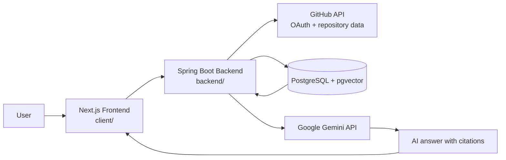
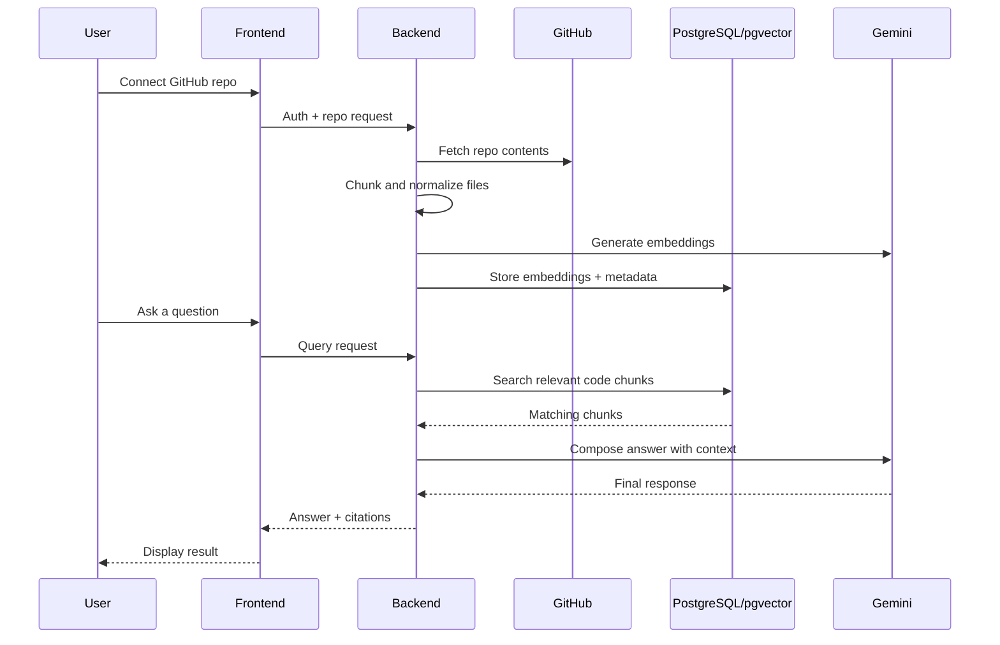

# DevPilot

DevPilot is a full-stack repository intelligence app that connects to GitHub repositories, indexes code into a vector database, and lets users ask natural-language questions about the repository. It combines a Spring Boot backend, a Next.js frontend, PostgreSQL with pgvector, and Google Gemini for embedding and RAG-style responses.

## Overview

The application is designed to:

- authenticate users with GitHub OAuth
- fetch repository metadata and file content
- chunk and normalize code files
- generate embeddings for code context
- store vectors in PostgreSQL + pgvector
- answer repository questions with AI-powered contextual retrieval
- present results in a chat-based dashboard UI

## Architecture





## Tech Stack

- Java 17+
- Spring Boot
- Spring Security OAuth2 Client
- Spring AI
- PostgreSQL + pgvector
- Next.js + React + TypeScript
- Docker Compose for local Postgres
- Google Gemini API

## Project Structure

```text
.
├── backend/
│   ├── .mvn/
│   ├── src/
│   ├── .gitignore
│   ├── pom.xml
│   ├── mvnw
│   └── mvnw.cmd
├── client/
│   ├── app/
│   ├── components/
│   ├── hooks/
│   ├── lib/
│   ├── public/
│   ├── package.json
│   ├── next.config.ts
│   ├── tsconfig.json
│   └── README.md
├── docker/
│   └── postgres/
├── docker-compose.yml
├── .env.example
├── .gitignore
├── README.md
└── .vscode/
```

## Prerequisites

Before running the app locally, make sure you have:

- Java 17 or newer
- Maven wrapper or Maven installed
- Node.js 18+ and npm
- Docker and Docker Compose
- A GitHub OAuth app configured in GitHub
- A Google Gemini API key

## Environment Setup

Create a local `.env` file based on `.env.example` and fill in your own values.

Example values:

```env
GITHUB_CLIENT_ID=your_github_client_id_here
GITHUB_CLIENT_SECRET=your_github_client_secret_here
GEMINI_API_KEY=your_gemini_api_key_here
DB_PASSWORD=your_local_db_password
TOKEN_ENCRYPTOR_PASSWORD=your_long_random_password
TOKEN_ENCRYPTOR_SALT=your_random_salt
FRONTEND_URL=http://localhost:3000
CORS_ALLOWED_ORIGINS=http://localhost:3000
```

## Local Database

The project includes Docker Compose configuration for PostgreSQL with pgvector.

```bash
docker compose up -d
```

This starts a local Postgres instance on port `5433` with the database name `devpilot`.

## Run the Backend

From the repository root:

```bash
cd backend
./mvnw spring-boot:run
```

The backend runs on port `8080` by default.

## Run the Frontend

From the repository root:

```bash
cd client
npm install
npm run dev
```

The frontend is typically available at:

- `http://localhost:3000`

## Security Notes

Do not commit real keys, OAuth secrets, Postgres passwords, or token encryption values to Git.
Use a local-only `.env` file and keep secret material out of the repository.

## Development Flow

1. copy `.env.example` to `.env`
2. start PostgreSQL with Docker Compose
3. start the backend
4. start the frontend
5. sign in with GitHub
6. connect a repository and start indexing
7. ask repository questions through the chat UI

## Notes

This README reflects the project structure and runtime conventions observed in the repository: Spring Boot backend, Next.js frontend, PostgreSQL + pgvector, GitHub OAuth, and Gemini-based retrieval.
